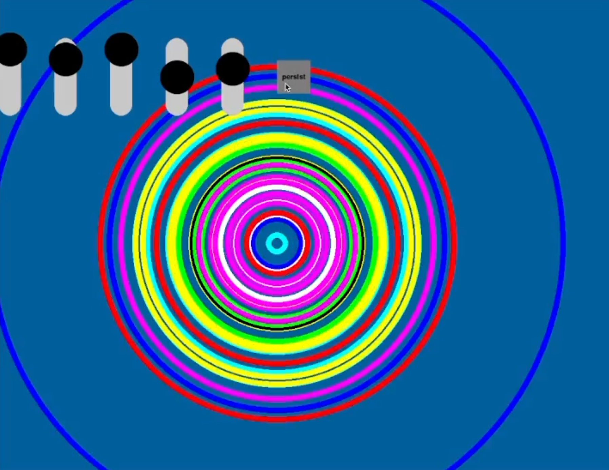

# eyesim



This is a simulator for the [eyesy](https://www.critterandguitari.com/eyesy) visual synth. Its purpose is to allow you to develop new eyesy visualization modes when you're too lazy to get out of bed and plug in audio, video, and power cables.

The simulator is a command line tool. As input, you give it a path to the mode folder containing a `main.py` file conforming to the [eyesy API](https://www.critterandguitari.com/manual?m=EYESY_Manual#52-eyesys-api). You can also give it a path to an audio file to use. Currently, only 16 bit WAV are usable. The audio file input is optional.

## Install

```bash
pip install eyesim
```

## Usage

You can run a test mode by supplying "test" as the path.
```bash
eyesim --mode-folder test
```

However, normally you would invoke it like:
```bash
eyesim --mode-folder "/path/to/S - Nice Mode/" --audio-file "/path/to/song.wav"
```

When the simulator is running, pressing the space bar to toggle visibility of the sliders and buttons that simulate the knobs on the physical eyesy device.

The full command line usage is:

```bash
$ eyesim --help
usage: eyesim [-h] -m MODE_FOLDER [-a AUDIO_FILE] [-w WIDTH] [-t HEIGHT]

Start eyesy simulation

optional arguments:
  -h, --help            show this help message and exit
  -m MODE_FOLDER, --mode-folder MODE_FOLDER
                        path to folder containing mode's main.py script
  -a AUDIO_FILE, --audio-file AUDIO_FILE
                        path to audio file to play (optional)
  -w WIDTH, --width WIDTH
                        window width in pixels
  -t HEIGHT, --height HEIGHT
                        window height in pixels
```

## Caveats

The eyesy code runs Python 2, and all the stock modes are Python 2. But, this package is written in Python 3. I did this in order to use the pygame widgets package and to use the latest scipy for reading wav files. The result is that you might find your mode or a stock mode breaks. In my experience, this is almost always due to one of two things:

1. a Python 2 style print statement, i.e., `print "foo"` rather than `print("foo")`
2. assumed integer division, i.e., assuming `1/2` results in an integer

The latter is easily fixed by explicitly using integer division (the `//` operator), which is compatible with both Python 2 and 3. Or, you can explicitly convert to int by `int(1/2)`.

## References

- eyes OS: https://github.com/critterandguitari/EYESY_OS/
- stock eyes modes: https://github.com/critterandguitari/EYESY_Modes_Pygame
